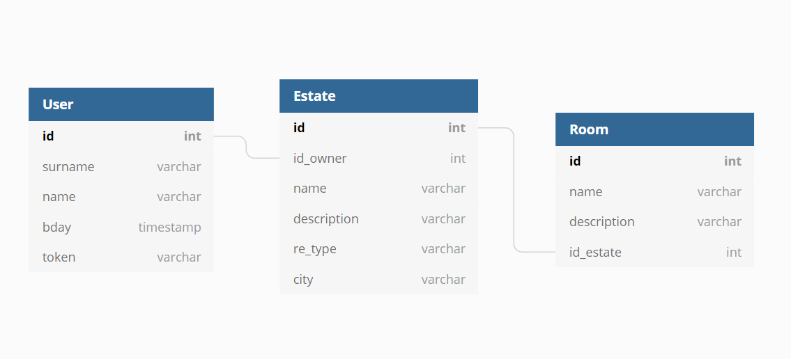

# RealEstate API Using Flask

This repo contains the implementation for a real estate service Rest API, implemented using Flask and SQLAlchemy 

## Used Python Packages
- Flask
- Flask-Login
- Flask-SQLAlchemy
- flask_marshmallow

## Database Schema

